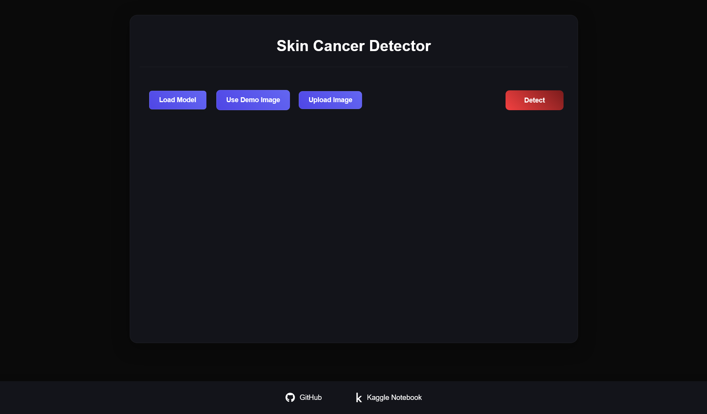
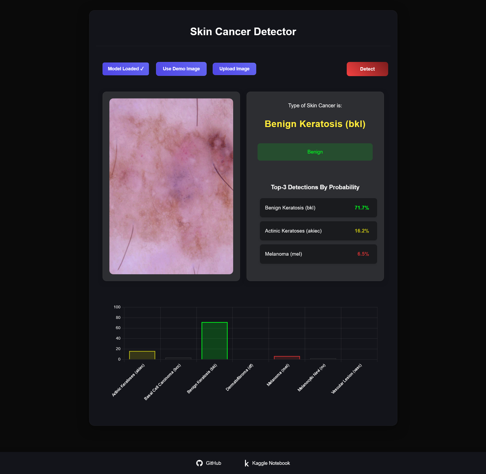
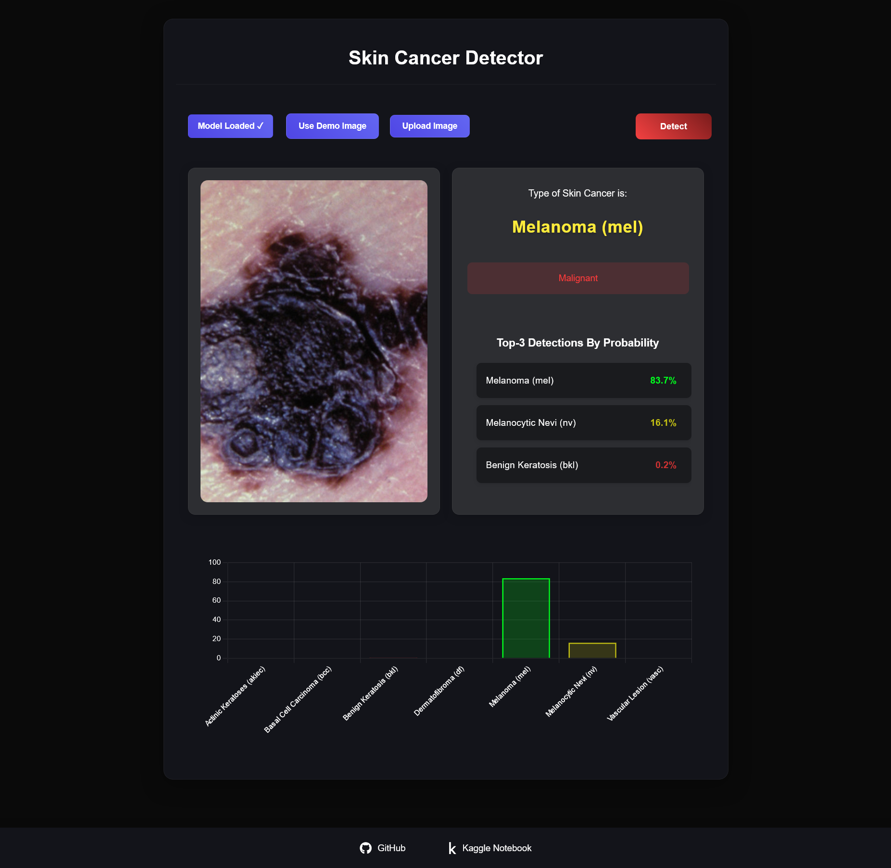

# Skin Cancer Detector Web Application

A web-based application for detecting different types of skin cancer using deep learning and TensorFlow.js. This application allows users to upload images of skin lesions and get real-time predictions about potential skin cancer types.

---

## Purpose

This web app uses computer vision to identify the three highest probability diagnoses for a skin lesion. A more advanced version could be used to identify cancerous skin lesions early.

---

## Features

- **Real-Time Detection**: Detects skin cancer in real-time using TensorFlow.js.
- **Multi-Type Support**: Identifies multiple skin cancer types.
- **User-Friendly Interface**: Features drag-and-drop image upload functionality.
- **Demo Images**: Provides sample images for testing.
- **Detailed Predictions**: Displays top-3 predictions with probability scores.
- **Responsive Design**: Optimized for both mobile and desktop users.
- **Interactive Visualization**: Visualizes prediction results with charts.

---

## Technologies Used

- **TensorFlow.js**: For deep learning model inference.
- **HTML5/CSS3**: For frontend design.
- **JavaScript**: For client-side logic and interaction.
- **Chart.js**: For visualizing prediction results.
- **MobileNet Architecture**: For efficient image classification.

---

## Lesion Types

The following lesion types are identified by the model:

- **nv**: Melanocytic nevi are benign neoplasms of melanocytes and appear in a myriad of variants.
- **mel**: Melanoma is a malignant neoplasm derived from melanocytes. Early excision can result in a cure.
- **bkl**: Benign keratosis includes seborrheic keratoses, solar lentigo, and lichen-planus-like keratoses.
- **bcc**: Basal cell carcinoma, a common epithelial skin cancer that rarely metastasizes.
- **akiec**: Actinic keratoses and intraepithelial carcinoma (Bowen’s disease) are UV-induced conditions that may progress to invasive squamous cell carcinoma.
- **vasc**: Vascular skin lesions, ranging from cherry angiomas to pyogenic granulomas.
- **df**: Dermatofibroma, a benign skin lesion.

Descriptions were adapted from relevant research literature.

---

## Getting Started

### Prerequisites

- A modern web browser (e.g., Chrome, Firefox, Safari, Edge).
- Internet connection (for loading the TensorFlow.js model).

### Running Locally

1. Clone the repository:
   ```bash
   git clone https://github.com/Arianrezaz/skin-cancer-detecton.git
   cd skin-cancer-detection
   ```

2. Start a local server:
   
   **Using Python:**
   ```bash
   python -m http.server 8000
   ```

   **Using Node.js:**
   ```bash
   npx http-server
   ```

3. Open your browser and navigate to:
   - **Python**: [http://localhost:8000](http://localhost:8000)
   - **Node.js**: [http://localhost:8080](http://localhost:8080)

---

## Usage

1. **Demo Testing**:
   - Click "Use Demo Image" to test with pre-loaded images.

2. **Image Upload**:
   - Click "Upload Image" to use your own skin lesion image.

3. **Prediction**:
   - Click "Detect" to get predictions.
   - View the top 3 predictions with confidence scores.

4. **Visualization**:
   - Check the interactive chart for the probability distribution of predictions.

---

## Model Information

The application utilizes a pre-trained MobileNet model fine-tuned on skin cancer datasets. It is capable of detecting various skin conditions, including:

- **Melanoma**
- **Basal Cell Carcinoma**
- **Squamous Cell Carcinoma**
- Other skin conditions

### Datasets Used

The model was trained using publicly available datasets such as the **ISIC (International Skin Imaging Collaboration)** dataset and the **HAM10000 dataset**, which contains a large number of labeled dermoscopic images of skin lesions. The dataset is released under a **CC BY-NC-SA 4.0 license** and cannot be used for commercial purposes.

### Image Format

The app accepts images in **JPG** or **PNG** format. Note that the model was not trained on mobile phone images, so prediction accuracy may vary for such images.

### Published Design

The design code and the step-by-step process used to train and test the model have been published on Kaggle. You can find the open-source notebook and test results [here](https://www.kaggle.com/).

---

## Screenshots

### Home Page


### Benign Results


### Malignant Results


---

## Contributing

Contributions are welcome! Please feel free to submit a pull request.

---


## Acknowledgments

- The TensorFlow.js team for the excellent framework.
- Developers of the MobileNet architecture.
- Contributors to the ISIC dataset and the HAM10000 dataset used in training.

---

## Contact

Email: [arian.rmn5281@gmail.com](mailto:arian.rmn5281@gmail.com)  

**Project Link**: [Skin Cancer Detector on GitHub](https://github.com/Arianrezaz/skin-cancer-detection)
